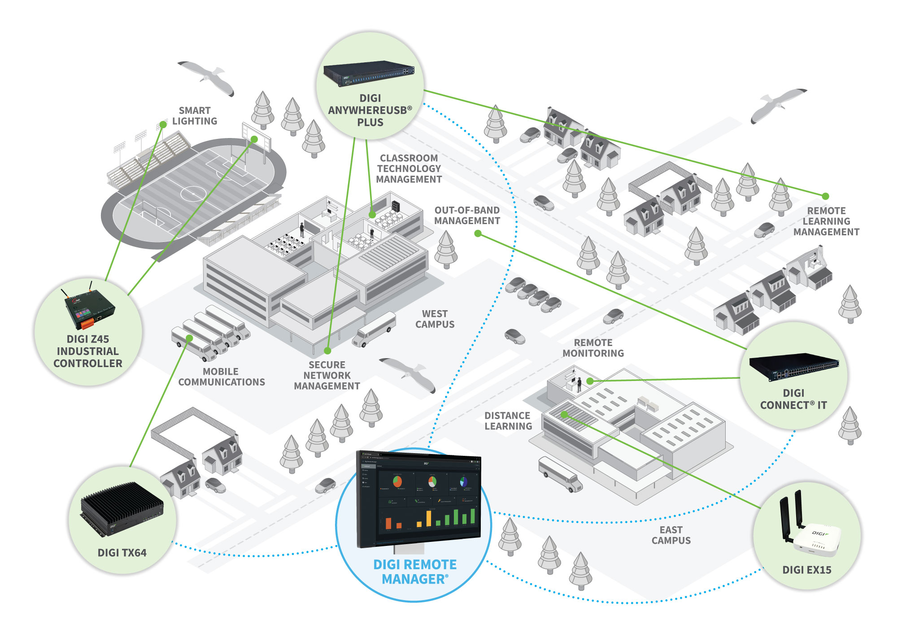
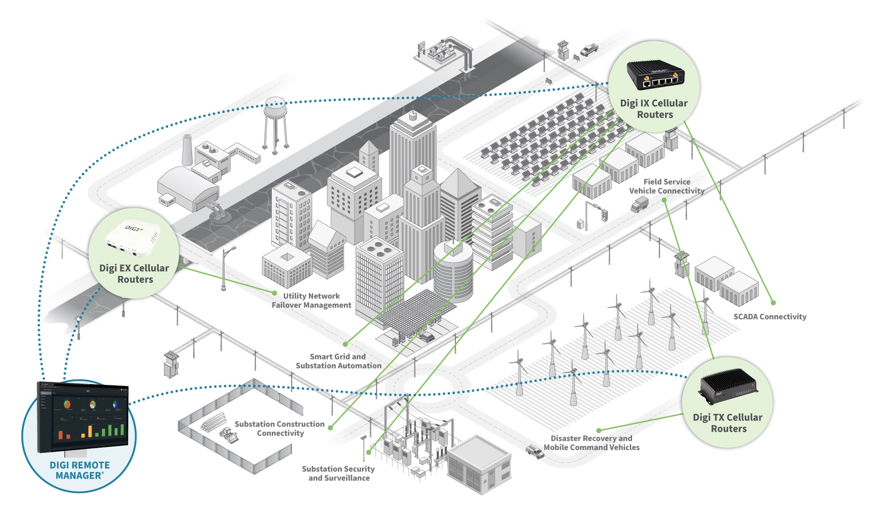

# Capstone Proposal — Starlink-Primary Resilient Gateway Reference Lab

**To:** [Manager]
**From:** Havi Arji, Intern
**Re:** A capstone I'd like to build before my internship ends
**Ask:** ~2 focused weeks and authorization for a small set of Digi equipment and licenses (listed below)

---

## The one-line pitch

Before I finish my internship, I want to build a **repeatable reference lab** that proves out a story our customers are already asking about: **Starlink as the primary WAN, backed by Digi 5G, managed as code through Digi Remote Manager**, with a **custom embedded Linux site sensor on ConnectCore (Yocto)**, and a **measured, side-by-side comparison of native SureLink failover vs. Digi WAN Bonding** — all validated with real fault injection, not slideware. And it demos from an iPad: **a live, tappable diagram of the lab** in the style of Digi's own industry illustrations, wired to real devices.

I'd like to leave Digi with an asset, not just a nice internship.

## Why this is worth your authorization

This isn't a personal science project. It produces things the team can reuse:

- **A sellable reference architecture** — "Starlink primary + Digi 5G + Opengear out-of-band" — that pre-sales and enablement can demo on demand.
- **Quantitative interoperability data** — native failover vs. WAN Bonding, by firmware, carrier, IPv4/IPv6, and MTU — the kind of numbers a customer evaluation actually needs.
- **Concrete findings for Product/Docs.** I've already built a register of a dozen documentation gaps and contradictions (e.g., an OM1300 cellular-support contradiction, undocumented Configuration Manager `scan_now` body, the BGP remote-ASN field name) that I'll close against real tenants and hand back with recommended owners.
- **Meaningful use of the portfolio** — IX40, DRM, Digi Containers, XBee Hive, ConnectCore/Yocto, and WAN Bonding, exercised together, not in isolated tutorials.

## What it demonstrates technically

Three industrial Digi gateways deliver dual-stack services and BGP routes over a Starlink-primary underlay, with in-band 5G failover, central management and telemetry, RF sensing, an embedded ConnectCore site sensor with store-and-forward (secure boot lands in a later phase), and a measured native-vs-Bonding comparison. To be clear about scope: **this does not replicate or simulate Starlink's proprietary network** — it measures Digi gateway behavior over a commercial Starlink service.

## The demo people can touch: a live lab diagram on an iPad

Digi already sells this way. Every industry page on digi.com anchors its solution in an isometric architecture illustration, and the [retail page](https://www.digi.com/solutions/by-industry/retail) goes one step further: hotspot dots over the illustration that pop up a card with the product's photo, role, and link. But even that one is marketing art — nothing on those pages is wired to a live device.

This is the [education page](https://www.digi.com/solutions/by-industry/education)'s campus diagram, the visual pattern I want to recreate for the lab:

*Source: [digi.com/solutions/by-industry/education](https://www.digi.com/solutions/by-industry/education). On the website this image is static (click-to-zoom only) — the capstone's version is live.*

**The capstone also ships a functional iPad app that turns this pattern into a working front end for the lab.** The app renders the site as an illustrated diagram like the one above; tapping any element — the Starlink dish, the IX40, the 5G link, the ConnectCore sensor, the XBee hive — opens that device's live panel: online/offline, which WAN is carrying traffic right now, signal and latency, last failover event, current sensor readings, plus a deep link into the device's page in Digi Remote Manager. During the fault-injection demo, the audience watches the diagram switch from Starlink to 5G in near-real time.

It's feasible with what's already in the ask: the data comes from the DRM v1 REST API, and the Push Monitor entitlement (already listed below) provides the near-real-time updates. A thin read-only proxy — a container in our existing Proxmox environment — keeps tenant credentials off the tablet. I'll build it as an installable web app first (runs full-screen on the iPad with zero Apple developer tooling on the critical path) and wrap it natively in SwiftUI if a Mac is available. Ring 0 scope is honest: site 1's devices, live status, and deep links; the three-site view lands with Ring 1.

## Where this fits Digi's own story

Of Digi's nine [industry solution pages](https://www.digi.com/solutions/by-industry), the closest match to this lab is **[Energy & Utilities](https://www.digi.com/solutions/by-industry/energy-and-utilities)**: its architecture diagram is built from exactly our elements — Digi IX routers at remote sites, "Utility Network Failover Management," disaster-recovery connectivity, and Digi Remote Manager at the center — and the same page features XBee and ConnectCore, the other two pillars of the capstone. Digi's own [WAN Bonding + Starlink post](https://www.digi.com/blog/post/digi-wan-bonding-starlink-ultra-fast-internet) names remote energy sites and oil & gas as the target use cases, but stops at the concept level. This lab turns that page into something a customer can watch fail over — and the iPad app is the demo surface.

*Source: [digi.com/solutions/by-industry/energy-and-utilities](https://www.digi.com/solutions/by-industry/energy-and-utilities).*

## Scope: honest about two weeks

I'm fast, but I won't pretend a 10-week program fits in two. I've structured it in concentric rings so the commitment is real:

- **Ring 0 — the 2-week commitment (what I'll demo):** one site fully working end to end (Starlink + 5G + DRM-as-code + BGP/IPv6 over an overlay + tuned SureLink failover, *measured*), the embedded ConnectCore sensor to a working state (custom Yocto image boots, a custom recipe bakes in the agent, which ships to our SIEM with an offline buffer that loses nothing on a link cut — secure boot is explicitly deferred to Ring 2), telemetry via XBee + a resource-capped Digi Container, the automation that clones a site with one command, a native-vs-WAN-Bonding A/B, a representative fault campaign (~10 reps on the headline failures), the interactive iPad app (site 1: tap a device on the lab diagram, see its live DRM-fed panel), and a recorded 12-minute demo plus a 90-second cut.
- **Ring 1 — as hardware arrives:** sites 2 and 3 stood up by the same automation, the Opengear/Lighthouse out-of-band plane integrated, and the app's three-site view.
- **Ring 2 — the full program:** three-site profile rotation, a 30-repetition statistical campaign with p50/p95/p99, TrustFence secure boot, secure OTA, and the full interoperability matrix.

**On Opengear:** because that hardware may take time to arrive, I've deliberately put the entire critical path on Digi equipment. Opengear's out-of-band layer is Ring 1 — its lead time can't block the capstone.

## What I'm asking you to authorize

For the 2-week sprint, one of each is enough (I'd request more only to build sites 2–3):

- **Hardware:** 1× IX40-05 (+ starter kit + DIN mount), 1× ConnectCore `CC-WMP255-KIT`, 1× XBee Hive + XBee 3 Zigbee kit.
- **Licenses/services:** DRM Premier + Digi Containers, a WAN Bonding Tier-3 trial + a small bonding VPS, and confirmation that our tenant carries Push Monitor and ConnectCore Cloud Services entitlements.
- **Connectivity:** one Starlink Priority plan and one 5G SIM.
- **Already available in the demo environment:** Proxmox, SIEM, RADIUS.
- **In parallel (can arrive later):** Opengear OM1304 + Lighthouse Enhance, and second/third units — for Rings 1–2.

I've written a full requirements list with exact SKUs, a day-by-day build runbook, the architecture, the test matrix and acceptance criteria, and a risk/verification register. Nothing gets purchased before its verification gate closes — in particular, **no SFP+ (the IX40 is SFP-only)** and no buying both the OM1304 and its fallback.

## Why me, why now

I already run the adjacent pieces in our demo environment (Lighthouse, Proxmox, SIEM, RADIUS), so the surrounding scaffolding exists. Doing this before I leave means the knowledge, the runbook, and the asset stay with the team — and a second engineer can re-run it from the runbook alone.

## What I need from you

1. A yes on the sprint scope and the equipment/licenses above.
2. Sign-off on objectives and disclosure/publication rules (I'll produce a sanitized public README and keep all secrets out of every artifact).
3. 15 minutes on day zero to align on success criteria — then I'll run it.

I'll deliver a rehearsed 12-minute demo driven from the iPad app, a one-page executive summary, a validated BOM, and a backlog of documentation findings for Product. If any assumption slips (hardware lead time, a plan's IPv6 behavior), I'll adjust scope transparently rather than overclaim.

Thank you for considering it — I think this is the most useful two weeks I could spend here.
