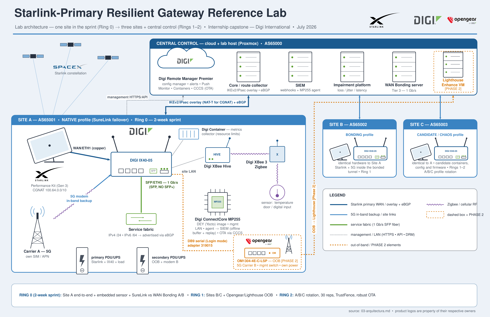

# Starlink-Primary Resilient Gateway Reference Lab

A reference lab for resilient remote sites using **Starlink as the primary WAN**, **5G as backup**, and a **Digi IX40-05** as the edge router. Digi Remote Manager provides fleet configuration and monitoring, while XBee and ConnectCore MP255 add site telemetry and embedded edge processing.

The project measures native SureLink failover against Digi WAN Bonding under repeatable network failures. A later phase adds Opengear/Lighthouse for an independent out-of-band management path.

## Project phases

- **Ring 0:** One complete site, automated configuration, failover testing, embedded sensor, and demo.
- **Ring 1:** Clone the design to Sites B and C and add Opengear OOB management.
- **Ring 2:** Multi-site test campaigns, secure boot, robust OTA, and deeper resilience testing.

This repository currently contains the architecture, requirements, build plan, test strategy, and risk register. Start with the [master plan](01-plan-maestro.md) or the short [executive pitch](08-executive-pitch-EN.md).
